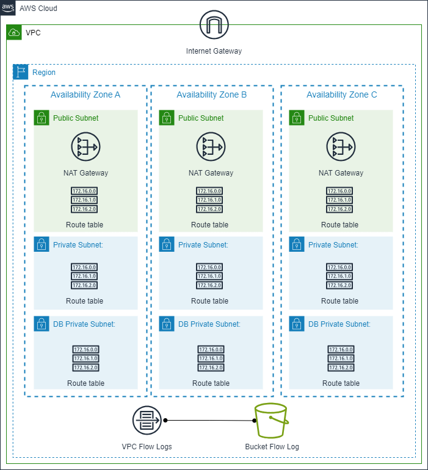

# Demo VPC with  CloudFormation

This repository contains a collection of AWS CloudFormation templates to deploy a VPC with different configurations.

### Resources deployed by the `vpc-with-cloudwatch-flowlogs.yaml` manifest:
- 3 Public subnet (AZ A to C)
- 3 Private subnet (AZ A to C)
- Single Internet Gateway.
- Single NAT Gateway.
- 1 Route table per subnet.
- VPC flow logs IAM Role and Policy
- VPC flow logs CloudWatch log group.

### Resources deployed by the `vpc-with-s3-flowlogs.yaml` manifest:
- 3 Public subnet (AZ A to C)
- 3 Private subnet (AZ A to C)
- 3 Database subnet (AZ A to C)
- Single Internet Gateway.
- One Nat Gateway Per AZ.
- 1 Route table per subnet.
- VPC flow logs
- S3 to store VPC flow logs.

### Deployment diagram:



## Tested with: 

| Environment | Application | Version  |
| ----------------- |-----------|---------|
| WSL2 Ubuntu 20.04 | aws-cli | v2.2.12  |

## Deployment How-To via AWS Console:

Follow the official AWS steps: 
- [DEPLOY INFRASTRUCTURE USING A CLOUDFORMATION STACK](https://www.wellarchitectedlabs.com/reliability/200_labs/200_deploy_and_update_cloudformation/1_deploy_infra/)

## Deployment How-To via CLI:

Perform an aws configure to specify your access key, secret key, and AWS Region:

``bash
aws configure
``

### Deploy:
```bash
aws cloudformation create-stack --stack-name Demo-VPC-Stack --template-body file://PATH-TO/vpc.yaml
```

### Monitoring deployment:
```bash
aws cloudformation wait stack-update-complete --stack-name Demo-VPC-Stack
```

### Update Stack
```bash
aws cloudformation update-stack --stack-name Demo-VPC-Stack --template-body file://PATH-TO/vpc.yaml
```

### Delete Stack
```bash
aws cloudformation delete-stack --stack-name Demo-VPC-Stack
```

## Author:

- [@JManzur](https://jmanzur.com)

## Documentation:

- [VPC with Terraform module](https://github.com/JManzur/terraform-aws-vpc)